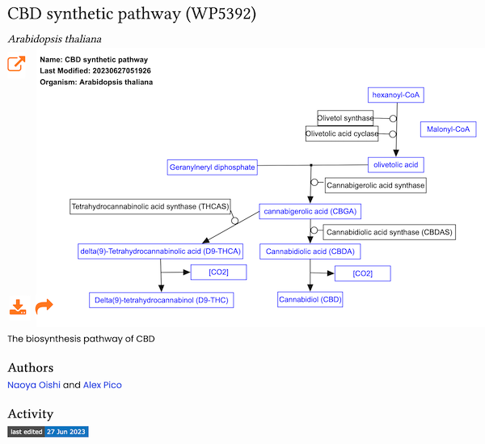

# Background
Despite decades of pathway database efforts and freely available pathway modeling tools, most researchers publish their biological pathway knowledge as static image figures made with general illustration tools. Prior to the BioHackathon, we had identified 103,009 pathway figures in the literature and performed optical character recognition (OCR) ([Pathway Figure OCR](https://pfocr.wikipathways.org) [@citesAsDataSource:Hanspers2020]. As an initial exploration, we extracted chemical names, disease terms, and human gene names. We knew, however, that many of the pathways represented biological processes and entities specific for plant, microbial and numerous non-model organisms.

To expand the pathway analysis environment to non-model organisms whose genomic and functional annotations are not organized in a central public database, we sought to expand the number of organism species included in the Pathway Figure OCR (PFOCR) database. Also, with continuing goal of expanding the use of [WikiPathways](https://www.wikipathways.org) [@citesAsAuthority:Pico2008] and the practice of modeling pathway information as proper data models, we trained new users of [PathVisio](https://pathvisio.org) [@citesAsAuthority:Kutmon2015] and guided them through the process of publishing at WikiPathways.

# Outcomes
We made use of the article annotations previously performed by [PubTator](https://www.ncbi.nlm.nih.gov/research/pubtator/) [@citesAsDataSource:Wei2019] and made available in a set of tables mapping taxonomy identifiers to PMIDs via [FTP](https://ftp.ncbi.nlm.nih.gov/pub/lu/PubTatorCentral/). Converting PMIDs to PMCIDs via NCBI, were then able to map taxonomy IDs to pathway figures in PFOCR.  NCBI provided a mapping between taxonomy IDs and latin genus-species names for improved human consumption. In total, 23,734 unique species were identified annotating the parent articles of PFOCR pathway figures. The breakdown of species-pathway mappings by taxonomic categories is presented in **Table 1**.

**Table 1.** The number of new species added to Pathway Figure OCR database in BH23. 

| Category                    | Number of Species | Number of Pathways |
|-----------------------------|------------------:|------------------:|
| Plants and Fungi            |             9,780 |             25,615 |
| Bacteria                    |             7,551 |             13,688 |
| Invertebrates               |             2,989 |             12,568 |
| Viruses                     |             1,336 |             10,682 |
| Vertebrates                 |             1,122 |              9,437 |
| Mammals                     |              353 |             13,788 |
| Rodents                     |              162 |             34,766 |
| Phages                      |              120 |                886 |
| Environmental samples       |              112 |              2,438 |
| Primates                    |              107 |             42,314 |
| Synthetic and Chimeric      |               80 |              1,349 |
| **TOTAL**                   |            23,734 |            167,871* |

\* Including multi-species pathways 

Many of the figures were annotated by multiple species, i.e., where dozens of species are mentioned in the article. By manually inspecting multiple cases, it is clear that not all of the article-level species annotations are relevant to each and every figure within a given article. It is also challenging to predict which species or subset of species would be most relevent to a given researcher. For example, one researcher might be interested in *Citrus reticulata* while another is interested in *Citrus unshiu*. An article could be annotated with both of these (along with many other mandarin speceis). The genes in a particular pathway figure in that article could be accurately mapped to any number of species. Is only one correct? Are all of them correct? More work is needed to refine and possibly prioritize species annotations to help researcher find the most relevant pathways to their topic of study.

A specific case study, we focused on the 2,763 pathway figures newly annotated as pertaining to *Danio rerio*, or zebrafish. We constructed a lexicon of zebrafish gene names and their corresponding NCBI Gene IDs. By applying this lexicon in the PFOCR pipeline step that performs named entity recognition, we could extract all mentions zebrafish gene names from the previously obtained OCR contents for each pathway figures. We thus discovered 3,200 zebrafish-specific genes that are involved in these pathways. For the first time, zebarfish researchers are now able to focus on the most relevant subset of published pathway figures in their studies, for example, involving pathway analysis, data visualization, or novel pathway modeling.

Published pathway figures provide a great starting point for pathway modeling. With the original figure as a reference, a pathway author can quickly render the biology as a computational data model using PathVisio. In fact, PFOCR provides all the identified genes and chemicals as datanode entries that can simply be copy-pasted onto a PathVisio canvas, saving a considerable amount of time otherwise spent on database queries and confirmation. During the BioHackathon, we trained four researchers on how to use [PathVisio](https://pathvisio.org) [@citesAsAuthority:Kutmon2015] and guided them through their first pathway authoring experience at [WikiPathways](https://www.wikipathways.org) [@citesAsAuthority:Pico2008]. In true hackathon fashion, we encountered an installation issue on a particular environment (M1 Mac, Ventura 13.4.1). We could not install it following the [existing documentation](https://pathvisio.org/downloads) (especially the Java 8 setup), so we hacked a solution and [posted the issue](https://github.com/PathVisio/pathvisio/issues/195) on its open source [GitHub repository](https://github.com/PathVisio/pathvisio). The four new authors created or edited the following pathway diagrams using PathVisio and successfully published their work at WikiPathways:
- Representative anthocyanin biosynthetic pathway ([WP5391](https://www.wikipathways.org/pathways/WP5391.html)) (Bono)
- CBD synthetic pathway ([WP5392](https://www.wikipathways.org/pathways/WP5392.html)) (Oishi, **Figure 1**) 
- Network map of SARS-CoV-2 signaling pathway ([WP5115](https://www.wikipathways.org/pathways/WP5115.html)) (Ono)
- Complement system [(WP2806](https://www.wikipathways.org/pathways/WP2806.html) (Ikeda)

**Figure 1.** The CBD synthetic pathway authored during the BioHackathon. 

# Future work
More work is required to refine and prioritize the species annotations for published pathway figures in PFOCR. Once the annotations are decided, we can then perform species-specific named entity recognition on the OCR contents to make the pathway database more relevant to researchers of plant, microbial and non-model organisms. Following this work, we would like to continue to promote the modeling of pathway knowledge in useful data formats by spreading the usage of PathVisio and WikiPathways. In particular, we are keen to make video tutorials (in [TogoTV](https://togotv.dbcls.jp/en/welcome.html)) on how to use, edit, add pathway data using these tools and resources. With the goal of curating more pathway models, we will also work on more efficient rendering methods, for example, by generating templates from pathway figure OCR extractinos, or even from generic text, such as tab-delimited format, or standard DataFrames commonly used in R and Python.

## Acknowledgements

We would like to thank the fellow participants at BioHackathon 2023 for their collaboration and constructive advice, which greatly influenced our project. We are grateful to the organizers for providing this platform and the developers of open source language models. Special thanks to our mentors, advisors, and colleagues for their guidance and support. Without their contributions, our project in linked data standardization with LLMs in bioinformatics would not have been possible.

## References

